# WordPress Ansible Deployment

Automated WordPress provisioning on **Amazon Linux 2023** using Ansible. This repository deploys a full LEMP-style stack—Nginx, PHP-FPM, MariaDB, and WordPress—on a single AWS EC2 instance.

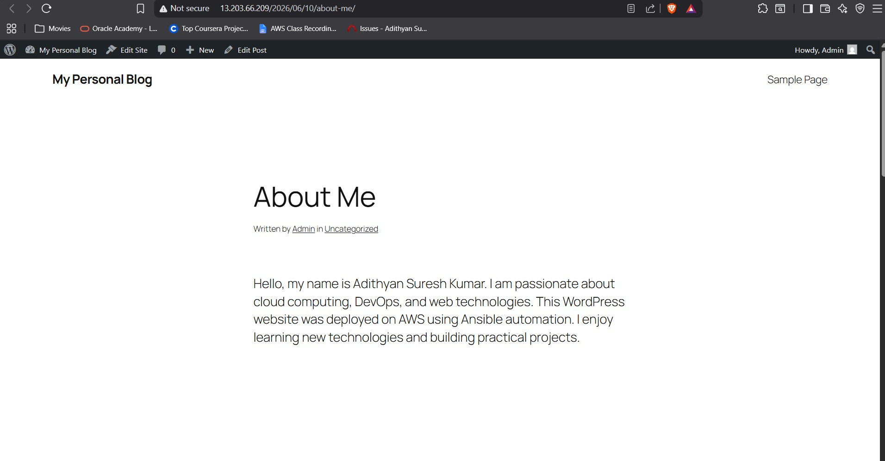

## Table of Contents

- [Overview](#overview)
- [Architecture](#architecture)
- [What's Included](#whats-included)
- [Screenshots](#screenshots)
- [Prerequisites](#prerequisites)
- [Repository Structure](#repository-structure)
- [Configuration](#configuration)
- [Deployment](#deployment)
- [Post-Deployment](#post-deployment)
- [Playbook Reference](#playbook-reference)
- [Security Considerations](#security-considerations)
- [Troubleshooting](#troubleshooting)
- [Roadmap](#roadmap)

## Overview

This project uses idempotent Ansible playbooks to install and configure the core components of a WordPress blog. Playbooks are split by concern—web stack, database, and application—so each layer can be run and maintained independently.

**Target environment:** AWS EC2 running Amazon Linux 2023.

## Architecture

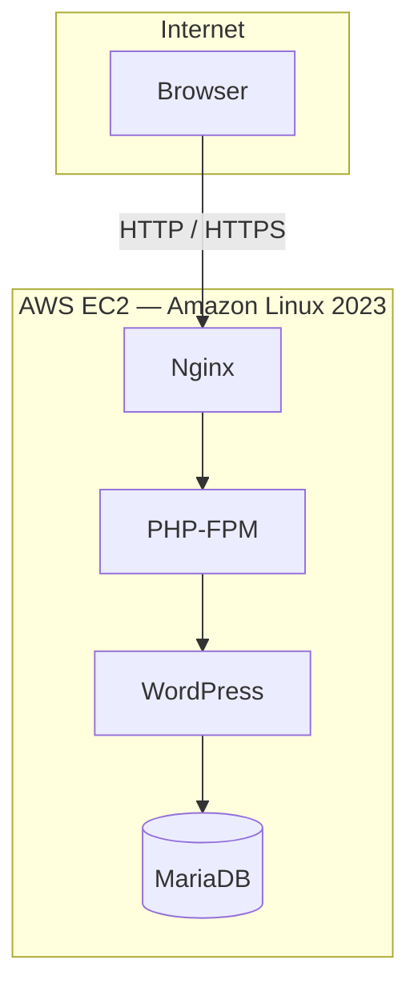

**Document root:** `/home/websiteuser/myblog/public`

## What's Included

| Component | Status | Playbook / Location |
|-----------|--------|---------------------|
| Nginx, PHP-FPM, MariaDB | Automated | `playbooks/webstack.yml` |
| WordPress database & user | Automated | `playbooks/database.yml` |
| WordPress file installation | Automated | `playbooks/wordpress.yml` |
| Nginx vhost (SSL-ready template) | Manual | `nginx/wordpress.conf` |
| Let's Encrypt SSL | Manual | Certbot (see [Screenshots](#ssl-certificate-lets-encrypt)) |
| phpMyAdmin | Manual | See [Screenshots](#phpmyadmin) |
| DuckDNS dynamic DNS | Manual | `mytempblog.duckdns.org` |
| SFTP user access | Planned | — |

## Screenshots

The following screenshots document a full deployment on AWS EC2, from database verification through a live HTTPS-enabled blog.

### Database Setup

MariaDB database and WordPress user created by `playbooks/database.yml`, verified on the EC2 instance:

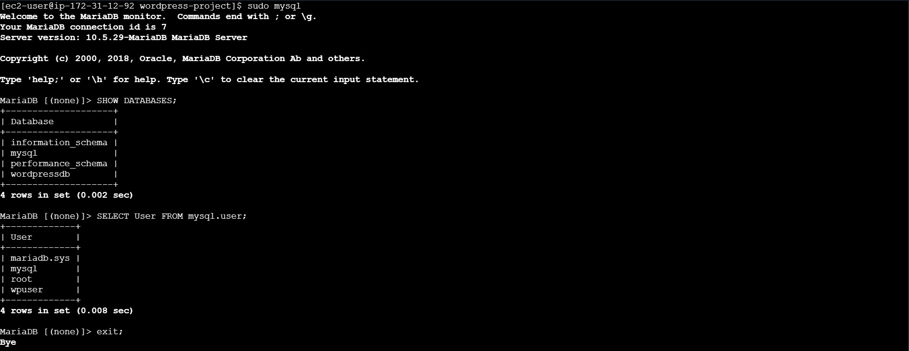

### WordPress Installation

WordPress web installer after playbooks complete and Nginx is configured:

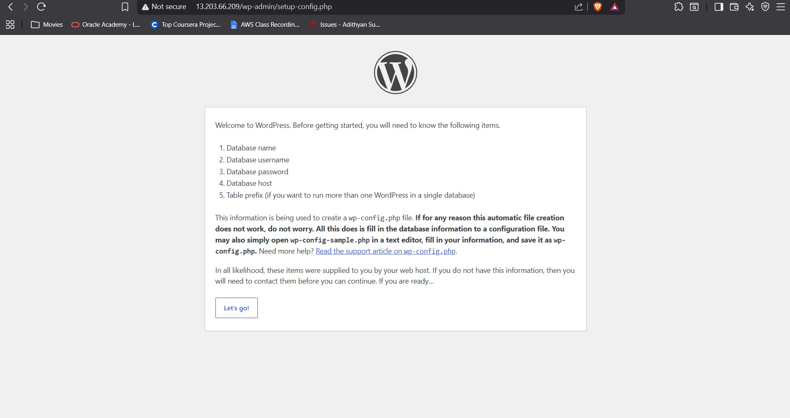

If the web server cannot write `wp-config.php` directly, WordPress provides the configuration to paste manually:

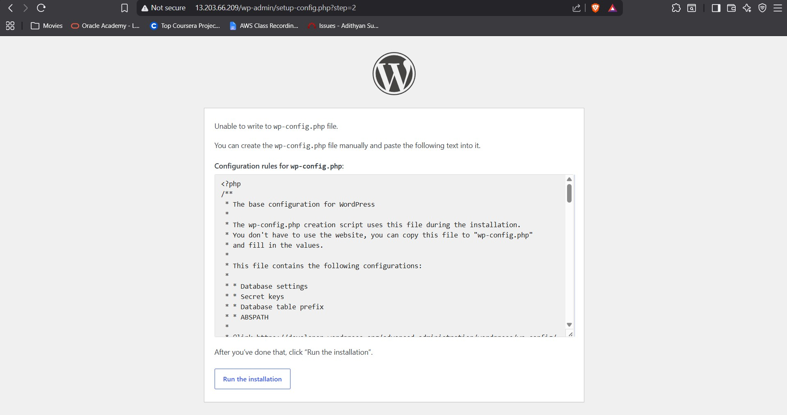

### Admin Dashboard & Live Site

WordPress admin login and dashboard after installation:

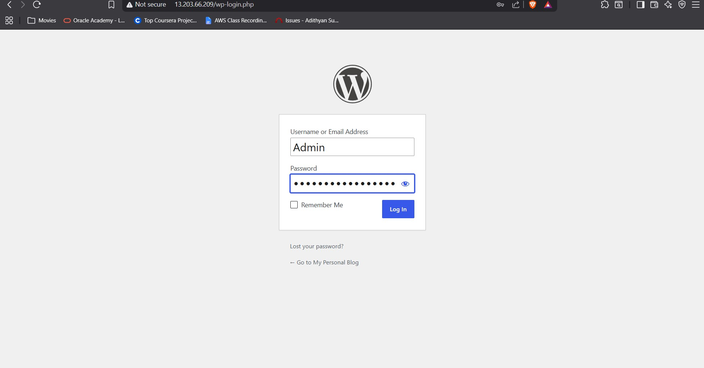

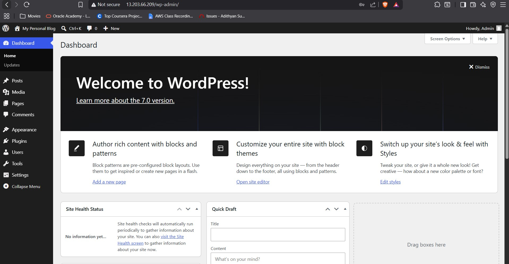

Published blog page on the deployed site:


### phpMyAdmin

Web-based database management for `wordpressdb`:

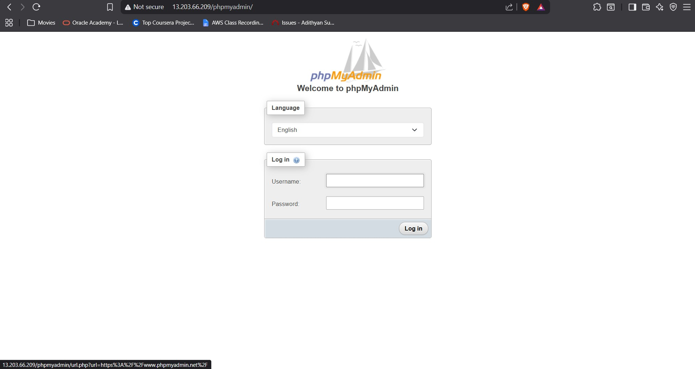

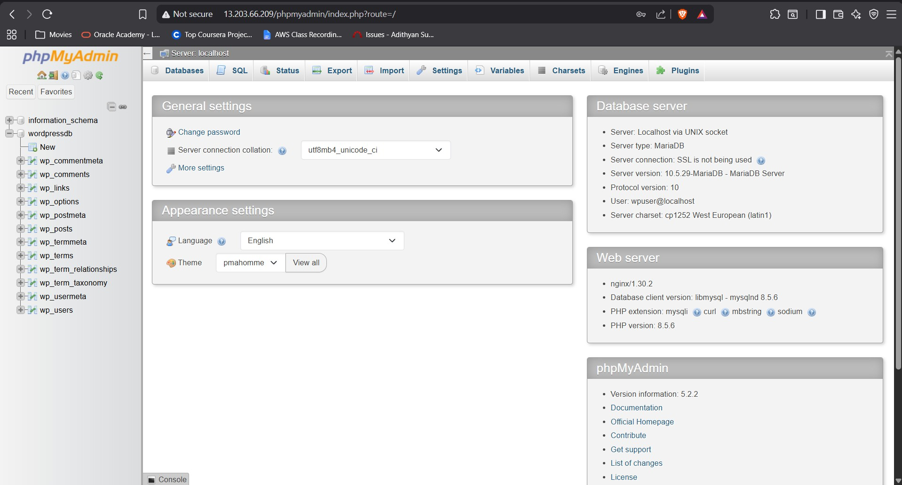

### SSL Certificate (Let's Encrypt)

SSL certificate issued with Certbot for `mytempblog.duckdns.org`:

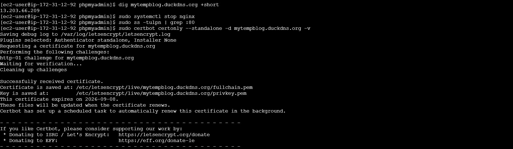

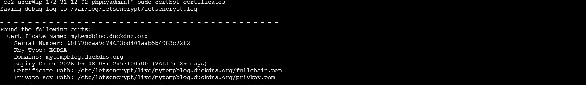

## Prerequisites

### Server

- EC2 instance on **Amazon Linux 2023**
- Security group allowing **22** (SSH), **80** (HTTP), and **443** (HTTPS) as needed
- Sudo privileges on the target host

### Control node

- [Ansible](https://docs.ansible.com/ansible/latest/installation_guide/intro_installation.html) 2.14 or later
- Python 3 on the target host
- SSH access to the EC2 instance (or run Ansible locally on the instance)

```bash
# Amazon Linux / RHEL-family
sudo dnf install -y ansible
```

## Repository Structure

```
.
├── inventory              # Target hosts and connection settings
├── playbooks/
│   ├── webstack.yml       # Nginx, PHP-FPM, MariaDB, site user & directory
│   ├── database.yml       # WordPress database and DB user
│   └── wordpress.yml      # WordPress download and installation
├── nginx/
│   └── wordpress.conf     # Nginx virtual host template
├── screenshots/           # Deployment screenshots for documentation
└── docs/
    └── Wordpress Hosting via Ansible.pdf
```

## Configuration

### Inventory

The default inventory runs against the local machine, which is useful when executing playbooks directly on the EC2 instance:

```ini
[web]
localhost ansible_connection=local ansible_python_interpreter=/usr/bin/python3
```

For remote deployment, replace `localhost` with your instance hostname or IP and configure SSH credentials:

```ini
[web]
ec2-host ansible_host=203.0.113.10 ansible_user=ec2-user ansible_ssh_private_key_file=~/.ssh/my-key.pem
```

### Default values

| Setting | Value |
|---------|-------|
| Site user | `websiteuser` |
| Document root | `/home/websiteuser/myblog/public` |
| Database name | `wordpressdb` |
| Database user | `wpuser` |
| Database password | `StrongPassword123!` |
| Database host | `localhost` |
| Domain | `mytempblog.duckdns.org` |

> **Note:** Change default credentials before any production deployment. Consider [Ansible Vault](https://docs.ansible.com/ansible/latest/vault_guide/index.html) for storing secrets.

### Nginx template

`nginx/wordpress.conf` is configured for `mytempblog.duckdns.org` with HTTP-to-HTTPS redirect and Let's Encrypt certificate paths. Update `server_name` and certificate paths to match your domain before deploying.

## Deployment

Run playbooks **in order** from the repository root:

```bash
ansible-playbook -i inventory playbooks/webstack.yml
ansible-playbook -i inventory playbooks/database.yml
ansible-playbook -i inventory playbooks/wordpress.yml
```

### Deploy Nginx site configuration

The Nginx virtual host is not yet applied by a playbook. Copy and enable it manually:

```bash
sudo cp nginx/wordpress.conf /etc/nginx/conf.d/wordpress.conf
sudo nginx -t
sudo systemctl reload nginx
```

## Post-Deployment

1. Open your site in a browser (ensure Nginx is configured and listening).
2. Complete the WordPress web-based installer.
3. Enter the following database settings when prompted:

   | Field | Value |
   |-------|-------|
   | Database name | `wordpressdb` |
   | Username | `wpuser` |
   | Password | `StrongPassword123!` |
   | Database host | `localhost` |
   | Table prefix | `wp_` (default) |

4. If the installer reports permission errors, verify ownership of the document root:

   ```bash
   sudo chown -R websiteuser:websiteuser /home/websiteuser/myblog/public
   ```

5. Issue an SSL certificate with Certbot and reload Nginx (see [SSL screenshots](#ssl-certificate-lets-encrypt)).

## Playbook Reference

### `playbooks/webstack.yml`

Installs and starts Nginx, PHP-FPM, and MariaDB. Creates the `websiteuser` account and document root at `/home/websiteuser/myblog/public`.

**Packages:** `nginx`, `php`, `php-fpm`, `php-mysqlnd`, `mariadb105-server`

### `playbooks/database.yml`

Creates the WordPress database, application user, and grants full privileges on `wordpressdb.*`.

### `playbooks/wordpress.yml`

Downloads the latest WordPress release from [wordpress.org](https://wordpress.org), extracts it, and copies files into the site document root with correct ownership.

## Security Considerations

- Replace all default passwords before exposing the instance to the internet.
- Never commit real credentials or private keys to version control.
- Restrict inbound traffic with security groups; expose only required ports.
- Keep MariaDB accessible from `localhost` unless remote access is explicitly required.
- Terminate TLS with HTTPS in production using Let's Encrypt or another trusted certificate authority.

## Troubleshooting

| Symptom | Likely cause | Action |
|---------|--------------|--------|
| `dnf` / package errors | Wrong OS or missing sudo | Confirm Amazon Linux 2023 and `become: yes` works |
| 502 Bad Gateway | PHP-FPM not running or wrong socket | Check `systemctl status php-fpm`; verify socket path in Nginx config |
| Database connection failed | MariaDB down or wrong credentials | Verify service status and values in `database.yml` |
| WordPress permission errors | Incorrect file ownership | Set owner to `websiteuser:websiteuser` on document root |
| Unable to write `wp-config.php` | Web server lacks write access | Paste config manually as shown in [screenshots](#wordpress-installation) |
| SSL / certificate errors | Certs not yet issued | Stop Nginx, run Certbot standalone, then reload Nginx |

**Useful diagnostic commands:**

```bash
sudo systemctl status nginx mariadb php-fpm
sudo tail -f /var/log/nginx/error.log
mysql -u wpuser -p -h localhost wordpressdb
sudo certbot certificates
```

## Roadmap

- [ ] Ansible playbook for Nginx vhost deployment
- [ ] Certbot / Let's Encrypt automation
- [ ] DuckDNS dynamic DNS updater
- [ ] phpMyAdmin installation playbook
- [ ] SFTP user for content uploads
- [ ] Automated `wp-config.php` generation
- [ ] Ansible Vault integration for secrets

## Technologies

| Category | Tools |
|----------|-------|
| Cloud | AWS EC2 |
| OS | Amazon Linux 2023 |
| Automation | Ansible |
| Web server | Nginx |
| Application runtime | PHP 8 (PHP-FPM) |
| Database | MariaDB 10.5 |
| CMS | WordPress |
| Database admin | phpMyAdmin |
| SSL | Let's Encrypt (Certbot) |
| DNS | DuckDNS |
